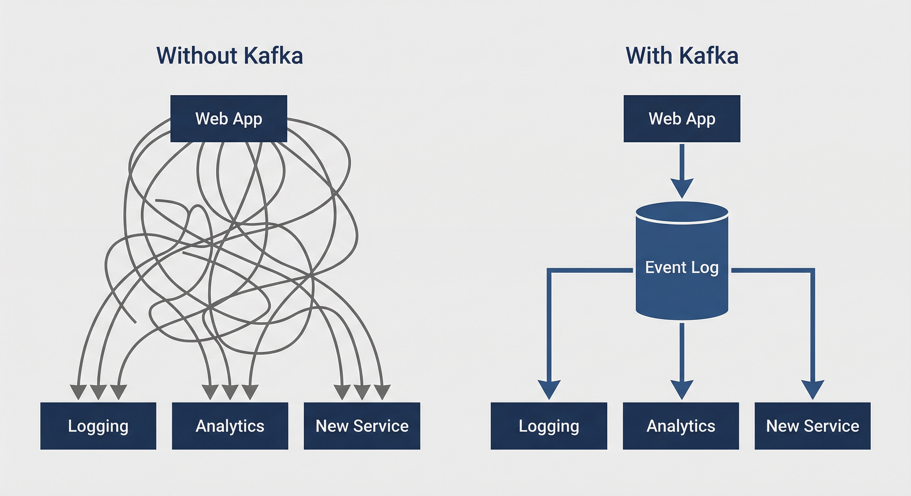
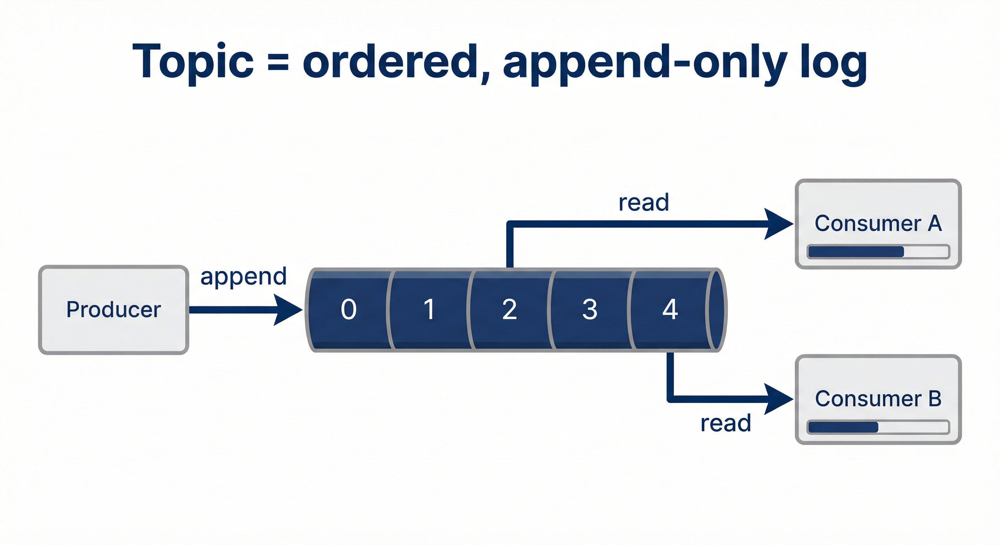
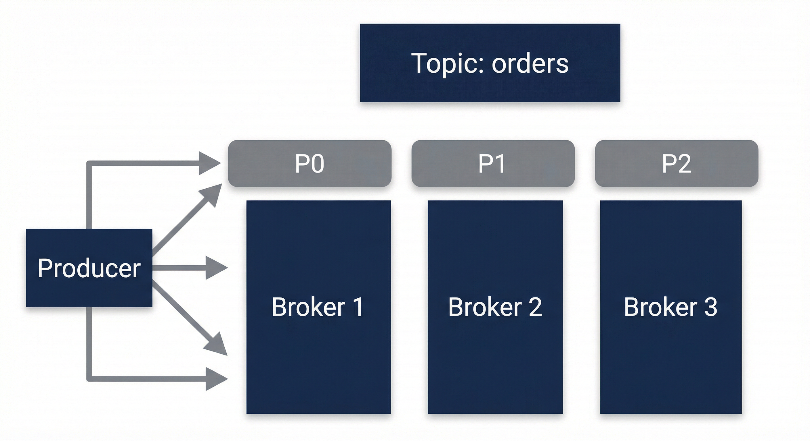
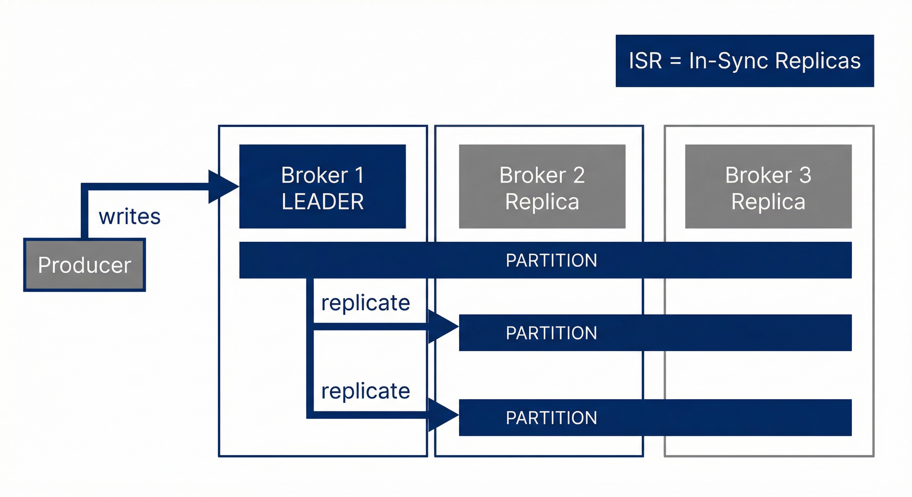
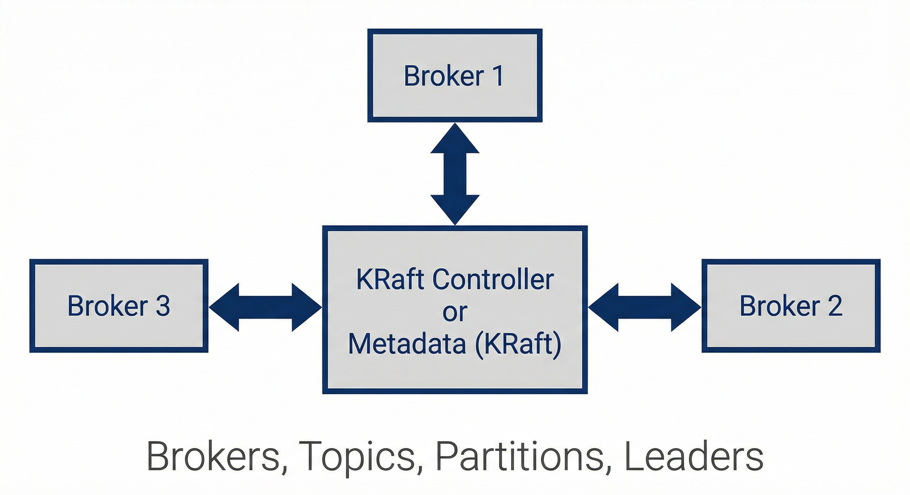
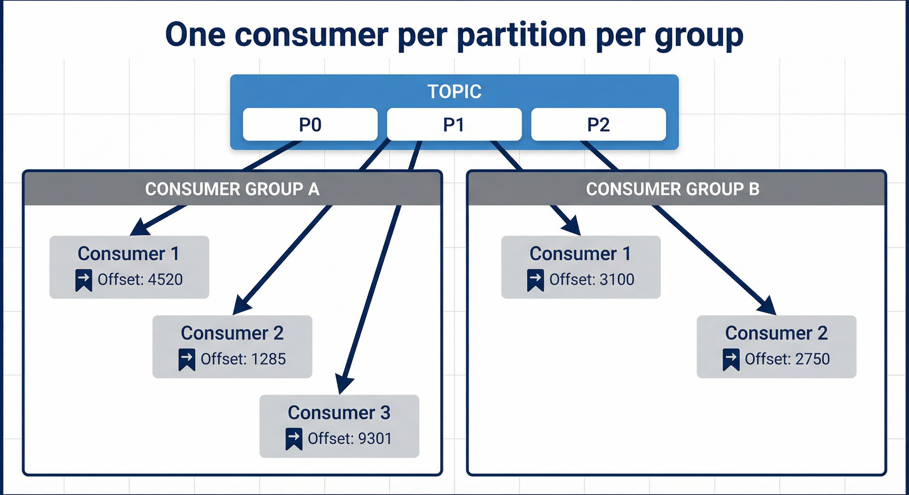
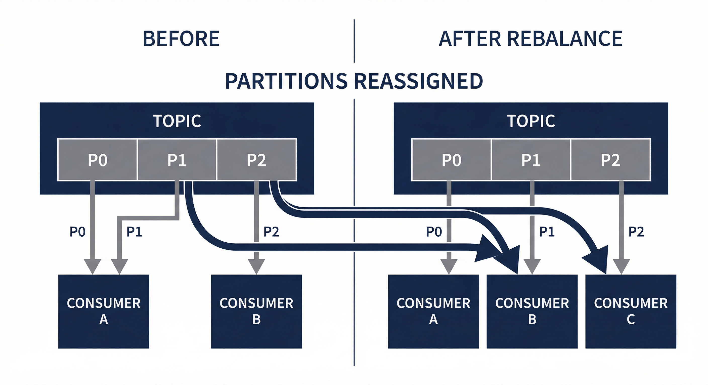

# Introduction to Kafka

## Title

# Introduction to Kafka  
## A Story of Problems and Decisions  
*From data in motion to event-driven systems at scale*

This intro builds the mental model step by step: why events, why a log, why Kafka looks the way it does. Theory first, no code.

---

## Part 1: The Data Problem

*Why moving and storing data at scale is hard*

---

## Systems Produce Data Everywhere

- Web apps: user clicks, sign-ups, orders.
- Services: logs, metrics, state changes.
- Devices: sensor data, heartbeats.

**The hard part** is not producing data — it's **moving** it, **storing** it durably, and letting **many consumers** use it without coupling or losing messages.

**Next:** How we used to connect systems (sync) and why we moved to events (async, then event-driven). Kafka exists because reliable, scalable event distribution needed a dedicated solution.

---

## Synchronous vs Asynchronous

- **Synchronous:** Request → wait → Response. Tight coupling; one system blocks on another; hard to scale.
- **Asynchronous:** Fire-and-forget or callback. Decoupling; non-blocking; better for scale, but who stores the message?
- **Event-driven:** Systems react to **events** (something that happened). Producers and consumers are **independent**; something in the middle holds and distributes events.

**Takeaway:** Event-driven systems need a **central store** that keeps events and lets many consumers read them. Kafka is that store — durable, scalable, and built for events.

---

## What Is an Event?

- An **event** is something that **happened** in the system (e.g. "OrderCreated", "UserSignedUp").
- Events are **immutable:** once they occur, they cannot be changed or undone.
- We don't "update" or "delete" events; we **compensate with new events** (e.g. "OrderCancelled").

**Why this matters for Kafka:** A system that stores events should **append only** — no in-place updates. That leads to the concept of a **log**. Immutability and append-only are at the heart of Kafka's design.

---

## Part 2: The Log Idea

*The data structure that makes event storage and replay possible*

---

## The Concept of a Log

- A **log** is an **ordered, immutable** sequence of records.
- New data is **appended** at the end; existing records are never changed or removed.
- Logs give **durability** (data is persisted) and **replayability** (you can read again from any position).

**Familiar idea:** Write-ahead logs in databases — same principle: order matters, no in-place updates.

**Next:** The first big problem — how to move data between many systems without point-to-point chaos. Kafka is, at its core, a distributed log (or many logs, one per partition).

---

## Moving Data Between Systems: The Central Event Log

- **Scenario:** A web app produces events; logging, analytics, and other services all need the same data.
- **Problem:** Connecting each producer to each consumer (point-to-point) doesn't scale — and if a consumer is down, data can be lost.
- **Solution:** A **central, durable event log.** Producers write once; many consumers read on their own. Data is **stored**, not just passed through.

That's why Kafka is called an **event streaming platform**, not just a message queue. One write, many reads — and the data stays so you can replay or add new consumers later.

---

## Organizing the Log: Topics

- Kafka organizes data into **topics.**
- A **topic** is a **named, ordered, append-only** stream of events — like a shared notebook: producers add to the end, consumers read at their own pace.
- **Fan-out:** Many consumers can read the same topic. **Replay:** You can read again from an earlier position.

**Important:** You never update or delete individual events in a topic. That's what makes replay and multiple consumers possible.

**Next:** How Kafka implements a topic — and what happens when one log isn't enough. Append-only is the contract; replay and multiple consumers follow from it.

---

## Kafka Architecture: Topics, Producers, Consumers

- A **topic** is the category/feed name; internally it is **implemented as a log** (we'll split it into partitions next).
- **Producers** publish records to topics.
- **Consumers** subscribe to topics and process records.
- The machines that hold the data are **brokers**; together they form a **cluster.**

**So far:** One topic = one ordered log. When volume grows, a single log becomes a bottleneck. **Next:** Scale by splitting the log into **partitions.** Brokers are the physical layer; topics and partitions are the logical model.

---

## Part 3: Scaling the Log

*Partitions, brokers, and where messages go*

---

## Scaling the Log: Partitions

- **Problem:** One machine (and one consumer) can't keep up with all the reads and writes.
- **Solution:** Split each topic into **partitions.** Each partition is its own **ordered log** on a broker, with its own **offset** sequence.
- **Result:** Writes and reads can happen in parallel — and **order is guaranteed within each partition**, not across the whole topic.

**Key point:** Order is **per partition**, not per topic. To keep order for a given key, send all messages with that key to the same partition (we'll see how next). More partitions mean more parallelism — this is how Kafka scales.

---

## Brokers and Clusters

- **Broker:** A Kafka server that holds partitions (as leader or replica).
- **Cluster:** A set of brokers; topics are spread across them for scale and fault tolerance.
- You connect to the cluster via **bootstrap servers**; Kafka then directs you to the right broker for each topic and partition.

**Physical vs logical:** Brokers and clusters are the **physical** layer; topics and partitions are the **logical** model you work with.

**Next:** When a producer sends a message, how does Kafka decide **which partition** it goes to?

---

## Partitioning Strategies: Which Partition Gets the Message?

The producer (or Kafka) decides **which partition** a record goes to:

- **Round Robin** (e.g. null key): Messages spread evenly; **order is not preserved** across the topic.
- **Key-based (hashing):** `partition = hash(key) % numPartitions`. Same key → same partition → **ordering guaranteed per key.**
- **Custom:** Your own logic (only when you really need it).

**Default:** Null key → round robin. Non-null key → key-based. Use keys when you need ordering for a given entity (e.g. user id, order id). Keys give you ordering and locality for a logical stream inside a topic.

---

## Part 4: Fault Tolerance and Discovery

*Replication, leaders, and how the cluster stays consistent*

---

## When Machines Fail: Replication and ISR

- **Problem:** If a broker dies, its partitions (and data) could be lost, and producers and consumers would break.
- **Solution:** **Replicate** each partition. One broker is the **leader** (handles reads and writes); others hold **replicas.** Replicas that are fully in sync are the **ISR** (In-Sync Replicas).
- **When the leader fails:** One in-sync replica becomes the new leader; clients keep going with minimal disruption.

Kafka is **fault-tolerant by design** — replication and ISR are why it can promise durability and availability.

**Next:** How do clients find out who the leader is and where each partition lives? **Metadata.**  
*ISR = the set of replicas that are safe to promote to leader, with no data loss.*

---

## Cluster Metadata: How Everyone Stays in Sync (KRaft)

- Kafka keeps a **consistent view** of: which brokers exist, which topics and partitions exist, and **who is the leader** for each partition. That's **metadata.**
- **In the past:** ZooKeeper held this metadata.
- **Today:** **KRaft** (Kafka Raft) — metadata lives inside Kafka, using a Raft consensus log. No ZooKeeper needed.

Producers and consumers use this metadata to find leaders and partition locations. Keeping it consistent means correct routing and smooth leader election. In the docs, **KRaft** is the modern way to run Kafka without ZooKeeper.

---

## Part 5: Writing and Reading Reliably

*Producers, consumers, offsets, and rebalances*

---

## Writing Reliably: Producers

- **Challenges:** The leader might crash after receiving a message; replicas might be slow; retries can create duplicates.
- **What you can control:**  
  - **Keys** — routing and ordering (same key → same partition).  
  - **acks** (0, 1, all) — how many replicas must acknowledge before the producer considers the write successful.  
  - **Batching** — trade a bit of latency for higher throughput.  
  - **Idempotence** — avoid duplicates when the producer retries.

Each setting exists because **real failures happened at scale**. We'll go deeper in the Producer chapter. For durable production, **acks=all** and **idempotence** are the usual choice.

---

## Reading at Scale: Consumers and Consumer Groups

- **Problem:** One consumer can't keep up; and we must avoid two consumers in the same group reading the same partition (double processing).
- **Solution:** **Consumer groups.** In a group, each partition is read by **one** consumer. Different groups can read the same topic (e.g. one for analytics, one for notifications).
- **Offsets:** Each consumer tracks its position (offset) per partition in `__consumer_offsets`. After a restart, it resumes from the last committed offset.

You get **scalable**, **replayable**, and **crash-resilient** consumption. Offsets are the bookmark in the log — next we'll see how they're stored and committed.

---

## Offsets: Where They Live and How to Commit Them

- **Where:** By default, Kafka stores consumer offsets in the internal topic `__consumer_offsets`, so consumers can resume from their last position after a restart.
- **Automatic commit** (`enable.auto.commit=true`): Kafka commits at intervals. *Upside:* Simple. *Downside:* If the consumer crashes before the next commit, you risk losing or duplicating work.
- **Manual commit** (`enable.auto.commit=false`): Your code calls `commitSync()` or `commitAsync()` after processing. *Upside:* You control when to commit (e.g. only after work is done). *Downside:* A bit more code.

**In practice:** For production, manual commit is usually preferred — commit only after you've successfully processed the messages (the pattern for at-least-once processing).

---

## Rebalances: When the Consumer Group Changes

- **What:** Kafka **reassigns partitions** to consumers in a group when something changes — who's in the group, or how many partitions the topic has.
- **When it happens:** A new consumer joins; a consumer leaves or crashes; the number of partitions in a subscribed topic changes.
- **Why:** So every partition is still read by exactly one active consumer, and load is spread fairly.
- **What you notice:** A short pause while assignments change; then consumers resume from their **committed offsets**, so already-committed work isn't processed twice.

Rebalances are normal — understanding them helps you design for both availability and latency. We'll see them in action in the Consumers chapter.

---

## Part 6: Data Format — Bytes, Serialization, and Schemas

*How producers and consumers agree on the shape of data*

---

## Messages Are Just Bytes

- Kafka brokers store **everything as bytes.** They don't interpret keys or values, and they don't enforce data types or schemas (by design — keeps brokers simple and format-agnostic).
- **What that means for you:** Producers and consumers must **agree** on how to turn application data into bytes and back. If they don't, the consumer can't read the data correctly.

**Next:** Serialization (producer) and deserialization (consumer) — and how to keep formats in sync over time with **schemas.** Brokers are simple pipes; the intelligence is in the clients and in schema management.

---

## Serialization and Deserialization

- **Serialization (producer):** Convert your objects (e.g. key string, value JSON) into byte arrays before sending to Kafka.  
  Example: `[key (string), value (json)]` → `[bytes, bytes]`
- **Deserialization (consumer):** Convert byte arrays back into objects your application can use.  
  Must use the **same format** as the producer.  
  Example: `[bytes, bytes]` → `[key (string), value (json)]`

**Common formats:** JSON, Avro, Protobuf. Avro or Protobuf with Schema Registry give compact storage and **schema evolution** (next slides). Mismatched serializers are a classic source of bad data; Schema Registry helps avoid that.

---

## Schema Registry

- **Role:** Central place that **stores and serves** message schemas (e.g. Avro, JSON Schema, Protobuf). Producers and consumers fetch the schema (by ID) and use it to serialize/deserialize.
- **Benefits:** Producers and consumers **agree on the structure** of data; you can **evolve** schemas over time without breaking existing consumers if you follow compatibility rules.

**Next:** What "evolve without breaking" means — **backward** and **forward** compatibility. Schema Registry is the contract store; compatibility settings are the rules for safe evolution.

---

## Schema Compatibility: The Three Types

To evolve schemas without breaking producers or consumers:

- **Backward:** New schema (Vn) can **read old data** (Vn-1). Safe when **consumers** upgrade first (they can still read current data).
- **Forward:** Old schema (Vn-1) can **read new data** (Vn). Safe when **producers** upgrade first (old consumers can still read new messages).
- **Full:** Both backward and forward. Safest for environments where upgrade order is unknown.

**Choose** based on who you deploy first — consumers or producers — and whether you need to support mixed versions. *Backward = consumer upgrades first; forward = producer upgrades first.*

---

## Backward Compatibility (Detail)

**Definition:** New schema (Vn) can read old data (Vn-1).

**Typical rules:**  
- **Remove a field** in Vn → Old data may still have it → New schema ignores it ✓  
- **Add a field with a default** in Vn → Old data doesn't have it → Default is used ✓  

**Takeaway:** Lets you **upgrade consumers** and deploy new code that still reads existing data safely. Backward is the most common requirement: new consumer code reading old messages.

---

## Forward Compatibility (Detail)

**Definition:** Old schema (Vn-1) can read new data (Vn).

**Typical rules:**  
- **Add a field** in Vn → Old consumer doesn't know it → Ignores it ✓  
- **Remove a field** in Vn that had a default in Vn-1 → Old schema still has the default → Works ✓  

**Takeaway:** Lets you **upgrade producers** and send new shapes without breaking existing consumers. Forward is useful when producers roll out new features before all consumers are updated.

---

## Part 7: Where We Go From Here

---

## How This Training Follows the Story

1. **Setup** — Run a cluster (e.g. Docker).
2. **Topics & partitions** — Create topics, see logs, leaders, ISR.
3. **Producers** — Durability, acks, batching in practice.
4. **Consumers & groups** — Offsets, scaling, rebalances.
5. **Failures** — Broker crashes, leader election, edge cases.

**One rule:** CLI and concepts first — you'll see Kafka's behavior directly before using it from application code. Same progression as this deck: problem → decision → concept, then hands-on.

---

## Next Step

**Start with [00-Setup](../Kafka-Internals-Training/00-Setup.md).**

You'll build the mental model **from the ground up** in the same order the problems were solved — and then reinforce it with the CLI.
