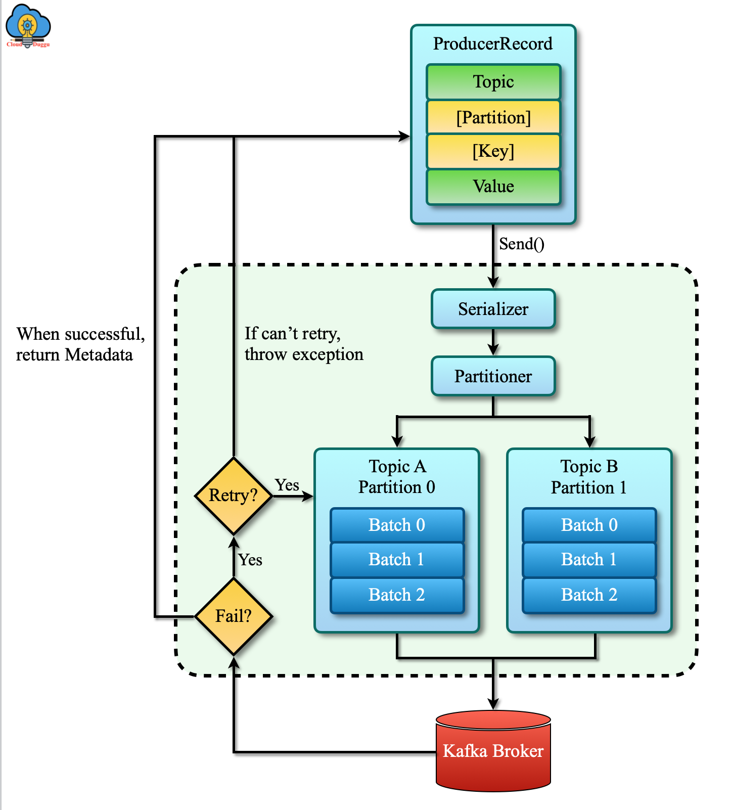

# Step 3 — Producers

**Check out the tag for this step** (when it exists):

```bash
git checkout step-03-producers
```

This step covers the Kafka producer: durability, delivery semantics, idempotence, ordering, and compression. Prerequisite: Step 2 (Topics) and the four-broker cluster.

**Copying commands (Docsify):** In Docsify, selecting and copying from code blocks sometimes does not put the command on the clipboard at all. If copy does not work: use the **script** when one is shown, or open the doc or script file in your editor and copy from there, or type the command manually.

---

## Producer flow at a glance

The diagram below sums up the path of a record from your code to the broker. We will go through each part in this step.



- **ProducerRecord** — Topic, optional partition, optional key, value. You pass it to **send()**.
- **Serialization** — Key and value are turned into bytes (we cover serializers and config).
- **Partitioning** — The partitioner chooses the partition (explicit partition, key hash, or round-robin); same key ⇒ same partition for ordering.
- **Batching** — Records for the same topic-partition are grouped into batches to reduce network and disk I/O.
- **Send to broker** — Batches are sent to the Kafka broker. On **failure**, the producer checks if the error is **retryable** (e.g. transient, not leader) or **non-retryable** (e.g. serialization, invalid config); retryable errors trigger a retry, otherwise an exception is thrown. Retries, when enabled, can cause **duplicates** (the same record may be written more than once); to avoid duplicates, enable **idempotence**.
- **Acknowledgement** — When the send succeeds, the broker returns **metadata** (topic, partition, offset), which acts as the acknowledgement that the record is stored.

This step details serialization, partitioning, batching, retries, acknowledgements (acks), and related settings.

---

## Topic for this step: user-clicks

All producer exercises in this step use a single topic: **user-clicks** (e.g. events like "user clicked on a page"). Create it once from the **project root** with **2 partitions**, **replication factor 3**, and **min.insync.replicas=2** (for durability and the acks exercise). Use the script or the command below.

<!-- tabs:start -->

<!-- tab:Linux / macOS -->

```bash
sh scripts/create-topic-user-clicks.sh
```

Or by hand:

```bash
docker compose exec kafka-1 /opt/kafka/bin/kafka-topics.sh --create \
  --topic user-clicks \
  --partitions 2 \
  --replication-factor 3 \
  --config min.insync.replicas=2 \
  --bootstrap-server kafka-1:9092,kafka-2:9092,kafka-3:9092,kafka-4:9092
```

<!-- tab:Windows -->

```batch
scripts\create-topic-user-clicks.cmd
```

Or by hand:

```batch
docker compose exec kafka-1 /opt/kafka/bin/kafka-topics.sh --create --topic user-clicks --partitions 2 --replication-factor 3 --config min.insync.replicas=2 --bootstrap-server kafka-1:9092,kafka-2:9092,kafka-3:9092,kafka-4:9092
```

<!-- tabs:end -->

---

## Content to cover


### 1. Role of the producer

- Sending records to topics; ProducerRecord (topic, partition, key, value) and **send()**; batching (records for the same topic-partition grouped before send).

### 2. Serialization

Key and value must be serialized to bytes before send. Producer config: `key.serializer`, `value.serializer`. For now, all producer records in this step use the **text (String) serializer**, the default. **Serialization with Avro** (schema, Schema Registry, evolution) is covered in a dedicated step: [Step 5 — Schema (Avro)](docs/05-schema.md).

### 3. Partitioning

It is up to the **producer** to choose the partitioning strategy. Default: **hash(key) % num_partitions** when key is present, else round-robin; custom partitioner can override (e.g. by header, or sticky partition for no key). The broker receives the partition index from the producer.

The console producer does not print the producer response (partition, offset). To **prove that same key → same partition**, produce messages with keys, then **consume** with `print.partition=true` and `print.offset=true` — the consumer output shows partition and offset for each message, so you see that all messages with the same key land in the same partition.

#### 3.1 Same key → same partition

Use the **user-clicks** topic (create it above if you haven’t). Produce several click events with the **same user** (key) and one with another user, then consume with partition and offset printed.

**Produce:** run the producer (command below), then type these **four lines** (one per line, Enter after each). Format: `key:value` (key = user id, value = click event).

**Lines to type:**

```
user-123:click home
user-123:click product
user-123:click cart
user-456:click checkout
```

Then press **Ctrl+C** to exit the producer.

<!-- tabs:start -->

<!-- tab:Linux / macOS -->

```bash
docker compose exec -it kafka-1 /opt/kafka/bin/kafka-console-producer.sh \
  --topic user-clicks \
  --bootstrap-server kafka-1:9092,kafka-2:9092,kafka-3:9092,kafka-4:9092 \
  --property parse.key=true \
  --property key.separator=:
```

<!-- tab:Windows -->

```batch
docker compose exec -it kafka-1 /opt/kafka/bin/kafka-console-producer.sh --topic user-clicks --bootstrap-server kafka-1:9092,kafka-2:9092,kafka-3:9092,kafka-4:9092 --property parse.key=true --property key.separator=:
```

<!-- tabs:end -->

**Consume** with partition and offset printed (Kafka 2.7+):

<!-- tabs:start -->

<!-- tab:Linux / macOS -->

```bash
docker compose exec kafka-1 /opt/kafka/bin/kafka-console-consumer.sh \
  --topic user-clicks \
  --bootstrap-server kafka-1:9092,kafka-2:9092,kafka-3:9092,kafka-4:9092 \
  --from-beginning \
  --property print.key=true \
  --property key.separator=: \
  --property print.partition=true \
  --property print.offset=true
```

<!-- tab:Windows -->

```batch
docker compose exec kafka-1 /opt/kafka/bin/kafka-console-consumer.sh --topic user-clicks --bootstrap-server kafka-1:9092,kafka-2:9092,kafka-3:9092,kafka-4:9092 --from-beginning --property print.key=true --property key.separator=: --property print.partition=true --property print.offset=true
```

<!-- tabs:end -->

You should see output like (format may vary by Kafka version):

```
Partition:1	Offset:0	user-123	click home
Partition:1	Offset:1	user-123	click product
Partition:1	Offset:2	user-123	click cart
Partition:0	Offset:0	user-456	click checkout
```

All messages with key **user-123** are in the **same partition** (e.g. Partition:1) with increasing offsets; **user-456** is in another partition. That reflects the producer response (partition, offset) and proves **same key → same partition**.

### 4. Acknowledgments and durability

The producer’s **acks** setting controls how many replicas must have written the record before the broker sends an acknowledgement:

- **acks=0** — No durability guarantee (fire-and-forget). The producer does not wait for any ack; best for availability and throughput, but messages can be lost.
- **acks=1** — Leader acks after writing to its log. Better than 0, but not enough if you need durability: if the leader fails before replicas catch up, the record can be lost.
- **acks=all** (or **acks=-1**) — Leader waits until all in-sync replicas have written. Great for durability when the topic has sufficient replication and **min.insync.replicas**; can be a bottleneck (higher latency, writes fail if not enough replicas are in the ISR).

When the send succeeds, the broker returns **metadata** (topic, partition, offset) as the acknowledgement. For the link between **acks=all** and **min.insync.replicas** (and what happens when ISR shrinks), see [Step 2 — Topics, Exercise 5: Min in-sync replicas](docs/02-topics.md?id=exercise-5-min-in-sync-replicas).


### 5. Retries

- `retries` and `retry.backoff.ms`; whether the producer retries depends on the **error type** — retryable (e.g. transient network, not leader) vs non-retryable (e.g. serialization, invalid config); relation to duplicates and need for idempotence when using at-least-once.

### 6. Idempotent producer

- `enable.idempotence=true`; deduplication by producer ID and sequence; retries without duplicates.

### 7. Delivery semantics

- At-most-once, at-least-once, exactly-once (brief); ordering is per partition.

### 8. In-flight requests and order

- `max.in.flight.requests.per.connection`; how multiple in-flight requests can cause out-of-order writes when retries happen; preserving order with `max.in.flight=1` vs `enable.idempotence=true`.

### 9. Compression

- Producer-side `compression.type` (none, gzip, snappy, lz4, zstd); trade-off CPU vs network/disk.

### 10. Key producer settings

- Reference: `bootstrap.servers`, `acks`, `retries`, `retry.backoff.ms`, `linger.ms`, `batch.size`, `enable.idempotence`, `max.in.flight.requests.per.connection`, `compression.type`, `key.serializer`, `value.serializer`.

### 11. Traps and best practices

- Relying on weak acks for durability; ignoring duplicates without idempotence; multiple in-flight without idempotence breaking order.

---

## Exercises (titles — what each will cover)

Exercises follow the **producer flow**: acknowledgement, retries and idempotence, in-flight and ordering, compression, then summary. Serialization has no exercise in this step — it is covered in a dedicated step.

| # | Flow step | Exercise | What it will cover |
|---|-----------|----------|--------------------|
| — | **Serialization** | *(no exercise here)* | Covered in [Step 5 — Schema (Avro)](05-schema.md) (dedicated step). |
| 1 | **Acknowledgement** | acks and durability | Topic with `min.insync.replicas=2` and RF≥2; produce with `acks=0`, `acks=1`, `acks=all`; optionally stop a broker and show `acks=all` fails when ISR &lt; min.insync.replicas. Takeaway: use `acks=all` for durability. |
| 2 | **Retries → duplicates → idempotence** | delivery semantics and idempotence | Produce with `enable.idempotence=false` then `enable.idempotence=true`; consume to show no duplicates with idempotence. Takeaway: idempotence avoids duplicates from retries. |
| 3 | **In-flight and order** | in-flight requests and ordering | Produce ordered messages (same key) with `max.in.flight.requests.per.connection=5` and `enable.idempotence=false` to show order can break; repeat with idempotence to show order preserved. Takeaway: multiple in-flight can break order without idempotence; with idempotence, order is preserved. |
| 4 | **Compression (batching efficiency)** | compression (optional) | Produce larger payload with `compression.type=none` then `compression.type=lz4`; show smaller on-wire or on-disk size. Takeaway: producer compression reduces network and storage at CPU cost. |
| 5 | **Summary** | conclusion | Recap: acks for durability, idempotence for no duplicates and ordered writes with in-flight &gt; 1, compression for efficiency. Optional table: goal → producer settings. |

---

**Next:** [Step 4 — Consumers](04-consumers.md) — consumer groups, offsets, partition assignment, and rebalance.

---

All commands in this step assume you are in the **project root** and the cluster is running. Use bootstrap `kafka-1:9092,kafka-2:9092,kafka-3:9092,kafka-4:9092` when using `docker compose exec kafka-1 ...`.
