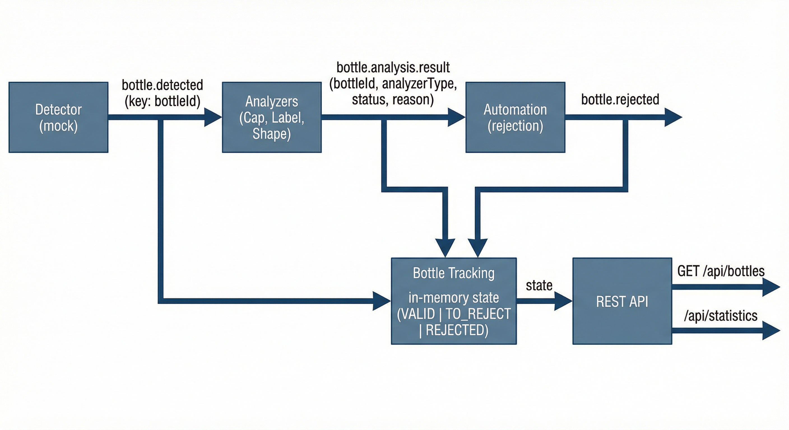

# Step 5 — Schema (Avro)

**Check out the tag for this step** (when it exists):

```bash
git checkout step-05-schema
```

This step covers **Avro schema** with Kafka: schema creation, evolution, compatibility, serialization with schema storage, and deserialization using the schema. Prerequisite: Step 2 (Topics), Step 3 (Producers), Step 4 (Consumers), and the four-broker cluster. A **Schema Registry** (e.g. Confluent Schema Registry) is typically used to store and serve schemas.

**Copying commands (Docsify):** In Docsify, selecting and copying from code blocks sometimes does not put the command on the clipboard at all. If copy does not work: use the **script** when one is shown, or open the doc or script file in your editor and copy from there, or type the command manually.

---

## What we will build in this step

We implement a **real-life example** to practice Schema Registry and Avro: a **bottle production supervision system** (event-driven, mock-based — no real hardware or AI). It demonstrates schema definition, serialization/deserialization, and event flow end to end.

Event-driven flow with **Confluent Schema Registry** and **Avro**: **Detector** → `bottle.detected` → **Analyzers** → `bottle.analysis.result` → **Automation** → `bottle.rejected`. **Tracker** consumes all three topics, updates an in-memory DB, and exposes the HTTP API (bottles, stats, Swagger).

**Scenario:** A bottle production line is supervised by events. A **detector** (mock) emits “bottle detected” events (bottleId, timestamp, imageUrl). Several **analyzers** (cap, label, shape — each in its own consumer group) consume those events, run a mock analysis (pass/fail), and publish **analysis results**. An **automation** service consumes analysis results and, when any analysis fails, publishes to **bottle.rejected**. A **bottle-tracking** module keeps in-memory state (detected, valid, to_reject, rejected) and exposes it via REST (Express, Swagger).

**Stack:** TypeScript, **Apache Kafka**, **Confluent Kafka JS**, **Schema Registry**, Avro for key/value, Express.js, Swagger, modular monolith (detector, analysis, automation, bottle-tracking, kafka, shared). Avro serialization, partition key by bottleId, manual offset commit, safe rebalance handling.



---

## Prerequisites

- Node.js 18+
- Docker. Start Kafka and Schema Registry from **project root**:

  ```bash
  docker compose up -d
  ```

  Wait ~30s. Compose exposes **INTERNAL** (kafka-1:9092, for containers) and **EXTERNAL** (localhost:9092,9094,9095,9096, for host). Use bootstrap `localhost:9092,localhost:9094,localhost:9095,localhost:9096` when running the bottle apps on your host. **Schema Registry** runs on `http://localhost:8081`.

---

## Creating the topics

Create the three Kafka topics from the **project root** (cluster must be running). Each topic has **3 partitions**, **replication factor 3**, and **min.insync.replicas=2**.

<!-- tabs:start -->

<!-- tab:Linux / macOS -->

```bash
sh scripts/create-topics-bottle-supervision.sh
```

Or by hand:

```bash
docker compose exec kafka-1 /opt/kafka/bin/kafka-topics.sh --create \
  --topic bottle.detected \
  --partitions 3 \
  --replication-factor 3 \
  --config min.insync.replicas=2 \
  --bootstrap-server kafka-1:9092,kafka-2:9092,kafka-3:9092,kafka-4:9092
docker compose exec kafka-1 /opt/kafka/bin/kafka-topics.sh --create \
  --topic bottle.analysis.result \
  --partitions 3 \
  --replication-factor 3 \
  --config min.insync.replicas=2 \
  --bootstrap-server kafka-1:9092,kafka-2:9092,kafka-3:9092,kafka-4:9092
docker compose exec kafka-1 /opt/kafka/bin/kafka-topics.sh --create \
  --topic bottle.rejected \
  --partitions 3 \
  --replication-factor 3 \
  --config min.insync.replicas=2 \
  --bootstrap-server kafka-1:9092,kafka-2:9092,kafka-3:9092,kafka-4:9092
```

<!-- tab:Windows -->

```batch
scripts\create-topics-bottle-supervision.cmd
```

Or by hand (one topic per line):

```batch
docker compose exec kafka-1 /opt/kafka/bin/kafka-topics.sh --create --topic bottle.detected --partitions 3 --replication-factor 3 --config min.insync.replicas=2 --bootstrap-server kafka-1:9092,kafka-2:9092,kafka-3:9092,kafka-4:9092
docker compose exec kafka-1 /opt/kafka/bin/kafka-topics.sh --create --topic bottle.analysis.result --partitions 3 --replication-factor 3 --config min.insync.replicas=2 --bootstrap-server kafka-1:9092,kafka-2:9092,kafka-3:9092,kafka-4:9092
docker compose exec kafka-1 /opt/kafka/bin/kafka-topics.sh --create --topic bottle.rejected --partitions 3 --replication-factor 3 --config min.insync.replicas=2 --bootstrap-server kafka-1:9092,kafka-2:9092,kafka-3:9092,kafka-4:9092
```

<!-- tabs:end -->

---

## Install

```bash
npm install
```

---

## Run

With Kafka, Schema Registry, and topics in place (see Prerequisites and Creating the topics), start all apps with:

```bash
npm run dev
```

This runs the **tracker**, **detector**, three **analyzers**, and **automation** in one terminal (each with its own color in the logs). The tracker serves the HTTP API and Swagger at http://localhost:3030 (e.g. `/bottles`, `/api-docs`).

---

### Apps and their roles

Each app is either a **producer**, a **consumer**, or **both**. Here's how they fit in the pipeline.

- **Detector** — **Producer only.** It does not consume any Kafka topic. You trigger it via HTTP: `POST /detections` with a body like `{ "bottleId": "bottle-0001", "imageUrl": "..." }`. It produces **to** `bottle.detected`: each request becomes one Avro message (bottleId, timestamp, imageUrl). That's the entry point of the pipeline.

- **Analyzers (cap, label, shape)** — **Consumer and producer.** Each analyzer **consumes from** `bottle.detected` (one consumer group per analyzer so all three see every detection). For each bottle detected, it runs a mock check (e.g. pass/fail), then **produces to** `bottle.analysis.result` one message per analyzer (bottleId, analyzer name, passed, timestamp, optional details). So one detection leads to up to three analysis-result messages.

- **Automation** — **Consumer and producer.** It **consumes from** `bottle.analysis.result`. When a message has `passed === false`, it **produces to** `bottle.rejected` (bottleId, reason, timestamp). So rejections are driven by failed analyses; it does not consume from `bottle.detected` or `bottle.rejected`.

- **Tracker** — **Consumer only.** It **consumes from** all three topics: `bottle.detected`, `bottle.analysis.result`, and `bottle.rejected`. It never produces to Kafka. It keeps an in-memory view of every bottle (detected → has results → valid or to_reject → rejected) and exposes that via HTTP: `/bottles`, `/bottles/:id`, `/bottles/status/...`, `/stats`, `/health`, and Swagger at `/api-docs`. So the tracker is the read side of the system.

---


## Schema Registry and Avro

Messages are **Avro**-encoded and registered in **Confluent Schema Registry**. Schema Registry runs in Docker (`http://localhost:8081`). Each event type has one Avro schema in `avro/` and one helper class in `src/shared/schemaRegistry.ts` that registers the schema and uses `@confluentinc/schemaregistry` to serialize/deserialize.

Override Schema Registry URL with `SCHEMA_REGISTRY_URL` (default `http://localhost:8081`).

### How to test

1. **Produce a detection:** `POST http://localhost:3010/detections` with body `{ "bottleId": "bottle-0001" }` (use `detector.http`).
2. Wait ~1–2 seconds for events to flow through analyzers and automation.
3. **Read state:** `GET http://localhost:3030/bottles`, `/bottles/bottle-0001`, `/bottles/status/detected`, `/stats`, `/health`; Swagger at http://localhost:3030/api-docs (use `tracker.http`).
4. **Inspect registry:** `curl http://localhost:8081/subjects` — expect `bottle.detected-value`, `bottle.analysis.result-value`, `bottle.rejected-value` after messages are produced.

### Schemas

| Topic | Subject (registry) | Schema file | Description |
|-------|--------------------|------------|-------------|
| `bottle.detected` | `bottle.detected-value` | `avro/BottleDetected.avsc` | Emitted when a bottle is captured. Fields: `bottleId`, `timestamp` (ISO-8601), `imageUrl`. |
| `bottle.analysis.result` | `bottle.analysis.result-value` | `avro/BottleAnalysisResult.avsc` | One result per analyzer. Fields: `bottleId`, `analyzer` (cap/label/shape), `passed`, `timestamp`, optional `details`. |
| `bottle.rejected` | `bottle.rejected-value` | `avro/BottleRejected.avsc` | Emitted when automation rejects a bottle. Fields: `bottleId`, `reason`, `timestamp`. |


## Schema compatibility

The Schema Registry in this project is configured with **FORWARD_TRANSITIVE** as the global default (see `docker-compose.yml`: `SCHEMA_REGISTRY_SCHEMA_COMPATIBILITY_LEVEL: FORWARD_TRANSITIVE`).

Under **FORWARD_TRANSITIVE**, the Registry checks **forward** compatibility: the **old** schema must be able to read data written with the **new** schema (i.e. existing consumers can still read records produced by updated producers). The check is applied transitively (the new schema is validated against every prior version for the subject). This allows you to roll out new producer versions first: existing consumers keep working because they can still deserialize the new payloads.

---

## Schema evolution

Two exercises to practice evolution with FORWARD_TRANSITIVE:

1. **Allowed evolution** — Add an **optional field with a default** to one of the Avro schemas (e.g. add `{ "name":"sourceLine","type": "string","doc":"sourceLine of bottle example A"}` to `BottleDetected.avsc`). Register the new schema: the Registry will accept it, because old consumers can ignore the new field and new consumers can read old records using the default. Deploy an updated producer and/or consumer and verify messages still flow.

2. **Rejected evolution** — Try to register a **breaking** change (e.g. remove an existing field, or change the type of a field). The Schema Registry will reject the new schema with a compatibility error. This shows how FORWARD_TRANSITIVE protects existing consumers from reading data they cannot handle.

   **What to expect:** A `RestError` with HTTP status **409**, and a message like: *"Schema being registered is incompatible with an earlier schema for subject 'bottle.detected-value'"*. The details will include `errorType: 'READER_FIELD_MISSING_DEFAULT_VALUE'` when you remove a field that had no default in the old schema (the old reader expects that field, so the new schema is rejected). Example detail: *"The field 'imageUrl' at path '/fields/2' in the old schema has no default value and is missing in the new schema"* with `compatibility: 'FORWARD_TRANSITIVE'`. Your app may log or throw this when it calls the registry to register the updated schema.