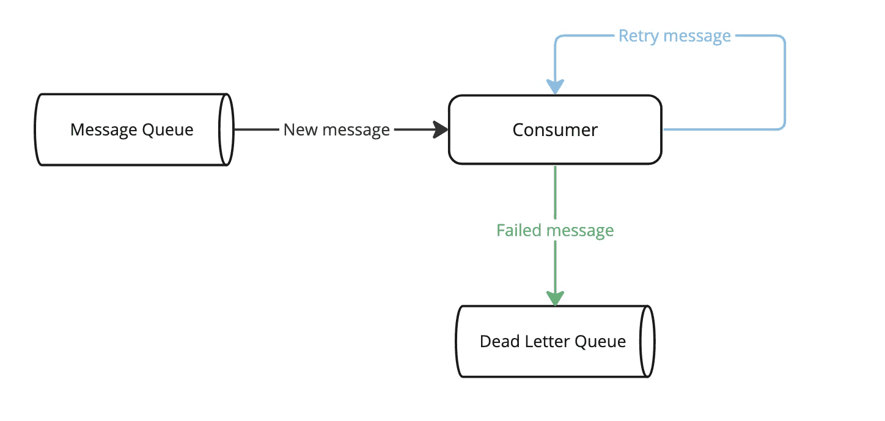
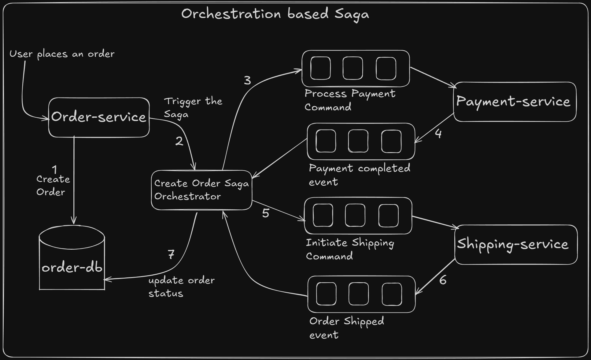
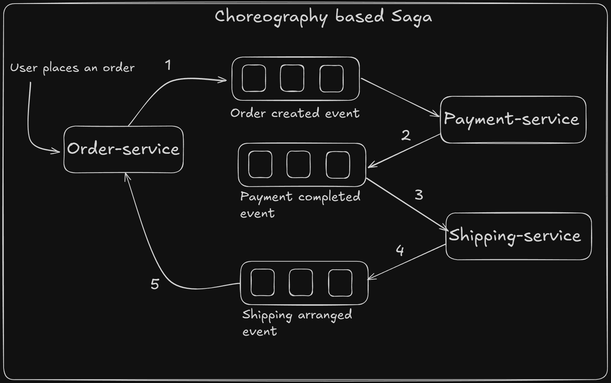

# Step 6 — Patterns

**Check out the tag for this step** (when it exists):

```bash
git checkout step-06-patterns
```

This step covers **three patterns** when building event-driven systems with Kafka: **dead-letter queue**, **saga**, and **dual write** (outbox pattern / listen to yourself). Prerequisite: Steps 1–5 (Infrastructure, Topics, Producers, Consumers, Schema).

**Copying commands (Docsify):** In Docsify, selecting and copying from code blocks sometimes does not put the command on the clipboard at all. If copy does not work: use the **script** when one is shown, or open the doc or script file in your editor and copy from there, or type the command manually.

---

## What this step covers

1. **Dead-letter queue (DLQ)** — When a consumer cannot process a message (e.g. after retries), send it to a separate topic (the dead-letter topic) for inspection, manual handling, or later replay. Keeps the main topic moving and isolates poison pills.
2. **Saga** — A distributed workflow that spans multiple services or steps; if one step fails, earlier steps may need to be compensated (rolled back or corrected). Choreography (each service reacts to events and emits its own) vs orchestration (a central coordinator drives the flow).
3. **Dual write / Outbox pattern (listen to yourself)** — When you must update a local database and publish an event to Kafka, writing to both in separate operations risks inconsistency (DB updated but Kafka publish fails, or the reverse). The **outbox pattern**: write the business row and an **outbox** row in a single transaction; a separate process (or poller) reads the outbox and publishes to Kafka, then marks the row as published. So you have one source of truth (the DB) and “listen to yourself” by reading your own outbox and publishing — no dual write.

---

## Content to cover

*(Expand each area with examples and references to the bottle-supervision project where relevant.)*

### 1. Dead-letter queue (DLQ)



- Why: messages that fail after retries would block the consumer or get lost if you skip and commit.
- Flow: consume from main topic → process → on repeated failure, produce the same (or enriched) message to a DLQ topic; then commit offset on main topic so the pipeline continues.
- DLQ topic: e.g. `bottle.analysis.result.dlq`; same or similar schema; optionally add metadata (original partition/offset, error, timestamp).
- What to do with DLQ: monitor, alert, manual fix or replay, or a dedicated consumer that retries or routes elsewhere.

### 2. Saga

- Context: a business process that involves several services or steps (e.g. order → reserve inventory → charge payment → ship). If “charge payment” fails, you must release the reservation (compensation). A saga defines how to move forward when things go well, and how to compensate when they do not.

#### 2.1 Orchestration-based saga

- A **saga orchestrator** coordinates the workflow. It sends commands to services (\"process payment\", \"initiate shipping\"), waits for replies/events, and decides the next step.
- On failure, the orchestrator sends **compensating commands** in reverse order (e.g. \"refund payment\", \"release reservation\").
- This makes the flow and state transitions explicit and easier to reason about in one place.
- Events and commands flow over Kafka topics; the orchestrator and services are just Kafka producers/consumers.



#### 2.2 Choreography-based saga

- There is **no central coordinator**. Each service reacts to domain events and emits its own events (e.g. `OrderCreated` → payment service charges; `PaymentFailed` → inventory service releases the reservation).
- Compensation is also event-driven: failures lead to new events that trigger rollback actions in other services.
- This keeps services loosely coupled but can make the overall flow harder to see, since the saga logic is spread across services.
- Kafka topics carry the domain events that drive the saga; each service subscribes only to the events it cares about.



#### 2.3 Orchestration vs choreography — pros and cons

| Approach | Pros | Cons |
|---------|------|------|
| **Orchestration** | Single place to see the whole flow; easier to debug and reason about; simpler to enforce ordering and timeouts. | Orchestrator can become a central dependency / bottleneck; more coupling to a specific workflow service. |
| **Choreography** | Loose coupling between services; each service owns its own part of the saga; easy to extend by adding new consumers of events. | Saga logic is scattered across services; overall flow can be hard to understand; risk of event storms or cycles if not designed carefully. |

### 3. Dual write and outbox pattern (listen to yourself)

- Problem: application updates the database and then publishes to Kafka. If the DB commit succeeds but the Kafka send fails (or the process crashes in between), you have inconsistent state. The reverse (Kafka sent, DB commit fails) is also possible.
- Outbox pattern: in one transaction, write the business data and a row in an **outbox** table (topic, key, value, created_at, published_at = null). A separate **outbox publisher** (poller or CDC) reads unpublished outbox rows, publishes to Kafka, and updates `published_at`. Only the DB is the source of truth; Kafka is fed from the outbox. No dual write from the app’s perspective — you “listen to yourself” by reading your own outbox and publishing.
- Variants: transactional outbox with a poller; or CDC (Change Data Capture) reading the DB log and publishing changes to Kafka.

---

All commands in this step assume you are in the **project root** and the cluster (and Schema Registry, if applicable) is running.
